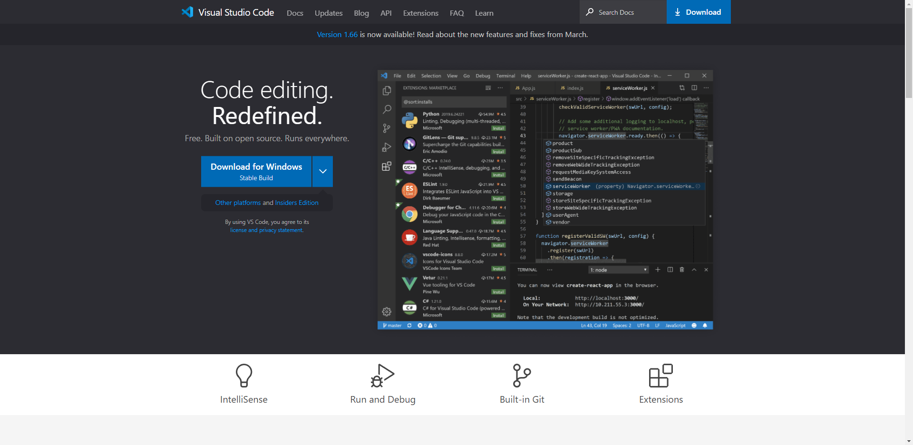
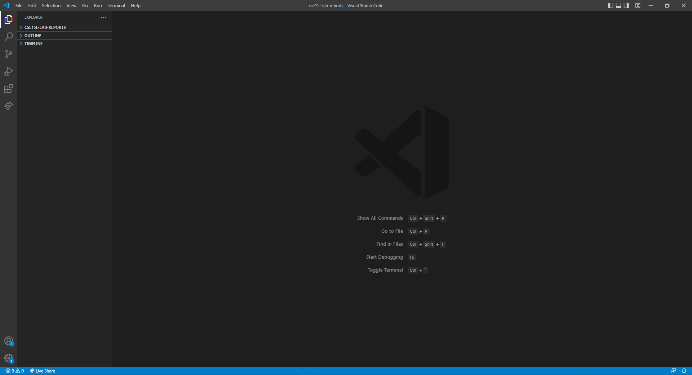

# Tutorial - How to Log into a Course-Specific Account on ieng6

## 1. Download Visual Studio Code

The first step is to download an IDE, such as Visual Studio code. A link to the download page is provided [here.](https://code.visualstudio.com/)

After downloading VSCode, it should look like this:

