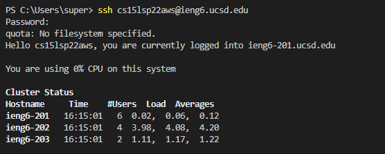
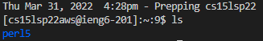
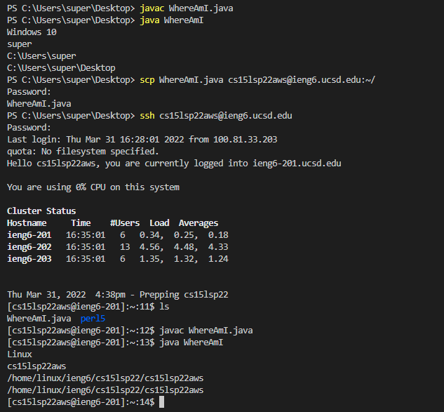
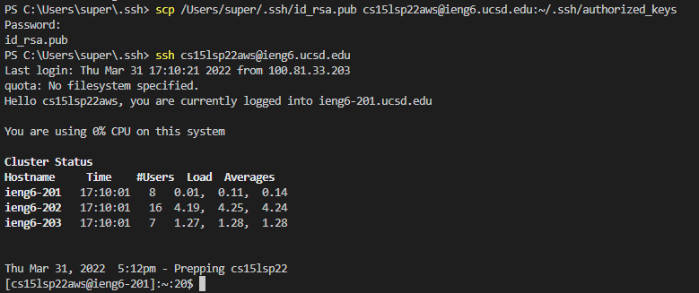
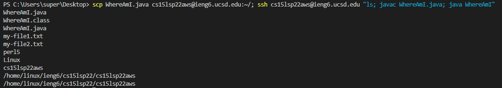

# Tutorial - How to Log into a Course-Specific Account on ieng6

## 1. Download Visual Studio Code

The first step is to download an IDE, such as Visual Studio code. A link to the download page is provided [here.](https://code.visualstudio.com/)


After downloading VSCode, it should look like this:


## 2. Connect remotely

In your IDE, run the following command, replacing `cs15lsp22zzz` with your own course-specific ID: ```ssh cs15lsp22zzz@ieng6.ucsd.edu```. This will allow you to connect remotely to the UCSD network. You will be prompted to enter your password to continue, so make sure you have changed your password using the [password reset tool.](https://sdacs.ucsd.edu/~icc/index.php)

After running the above command and logging in, your screen should look like the following screenshot:



## 3. Try out some commands

To ensure that everything is working properly, try running some SSH commands in the terminal. Some commands that you can run are `ls` to list the files in the directory, `pwd` to print the working directory, and `mkdir` to create a new directory. All of these commands will be executed on the remote computer rather than your local device!

Below is an example output after running the command `ls`.



## 4. Move files to the remote computer

A useful skill to have is to be able to move files between your local and remote devices; this can be done with the command `scp`. Below is an example of running `scp` to move a file called `WhereAmI.java` to the remote directory, using the command `scp WhereAmI.java cs15lsp22zzz@ieng6.ucsd.edu:/~`. Notice that the second argument specifies the name and file type of the file you intend to move, while the third argument specifies the directory you intend to move the file to—in this case, the root directory of the remote device.



## 5. Set up an SSH key

Right now, the process of moving files between your local and remote devices is fairly slow and clunky; one reason why this might be is the amount of time it takes to enter your password every time you log in. To fix this, we can use the command `ssh-keygen` to create a pair of keys that you can use to log into your remote device without entering a password. After running the command `ssh-keygen` on your local device, use `scp` to move the public key that was just created into a new directory called `.ssh/authorized_keys` on your remote device. An example of this is provided below:



If this is done correctly, you should no longer need to input your password to log into your remote device!

## 6. Optimize remote running

The process of running commands remotely can be made even faster. Here are some useful tips to take note of:
* Use semicolons to run multiple commands in sequence
* After running `ssh`, use quotes `""` to run a command directly on the remote server
* Press the up arrow to recall a command that you ran previously

An example of using semicolons and quotes to chain commands together is given below:


