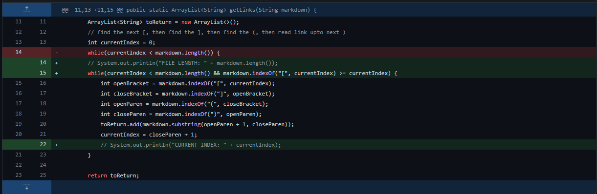
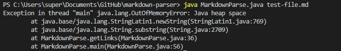
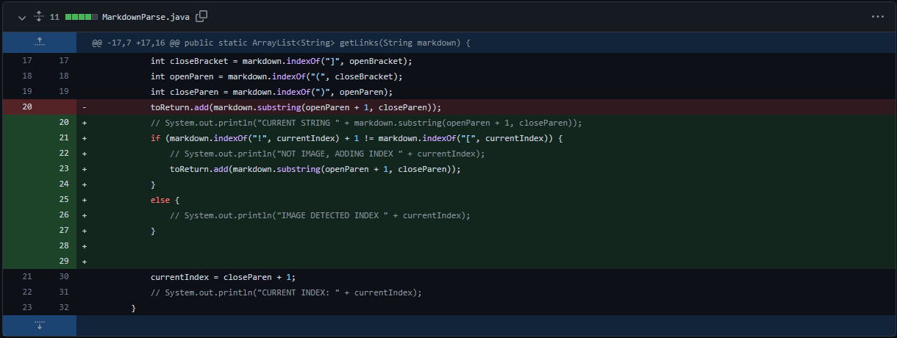
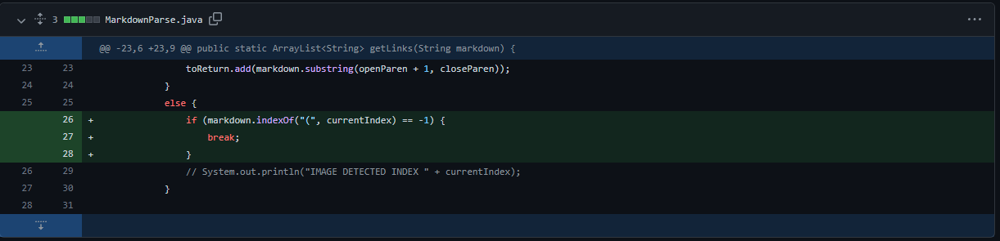

# Bugs, Symptoms, and Failure-Inducing Inputs

## 1. Extra characters at end of file causing infinite loop

A link to the file containing the failure-inducing input that prompted this change can be found [here.](https://github.com/mwchen25/markdown-parser/edit/main/test-file.md)

This image shows the symptom output after running the code with the first failure-inducing input. The bug caused an infinite loop, which eventually caused the program to run out of memory.

The symptom of this failure-inducing input was an infinite loop, so there was no output after running the file at the command line until the loop was manually terminated.

The bug was that the code did not address how to handle additional characters at the end of the input file. Therefore, any file with additional characters after its final link such as the one above could be considered a failure-inducing input, and would trigger the symptom of an infinite loop.

## 2. Code not recognizing images

A link to the file containing the failure-inducing input that prompted this change can be found [here.](https://github.com/mwchen25/markdown-parser/blob/main/test-file-3.md)

This image shows the symptom output after running the code with the second failure-inducing input. The bug caused image links to be printed out alongside website links, even though the program was supposed to filter out images and only print website links.

The symptom of this failure-inducing input was images being printed out alongside website links, when only website links were supposed to be printed.

The bug was that the code did not recognize when a link represented an image versus a website, so any file containing an image was a failure-inducing input. The symptom of this bug was the link to an image being printed, even though it should not have been printed.

## 3. Missing parentheses causing infinite loop

A link to the file containing the failure-inducing input that prompted this change can be found [here.](https://github.com/mwchen25/markdown-parser/blob/main/test-file-4.md)

This image shows the symptom output after running the code with the third failure-inducing input. The bug caused the code to loop infinitely, and the code would not exit the loop unless the process was manually killed by the user.

The symptom of this failure-inducing input was the same as in the first bug: since it caused an infinite loop, there was no output after running the file at the command line until the loop was manually terminated.

The bug was that the code could not handle an input without parentheses, as it continuously checked for parentheses without a way to exit if they were not in the file. Therefore, any file without parentheses was a failure-inducing input that would have caused the symptom of an infinite loop.