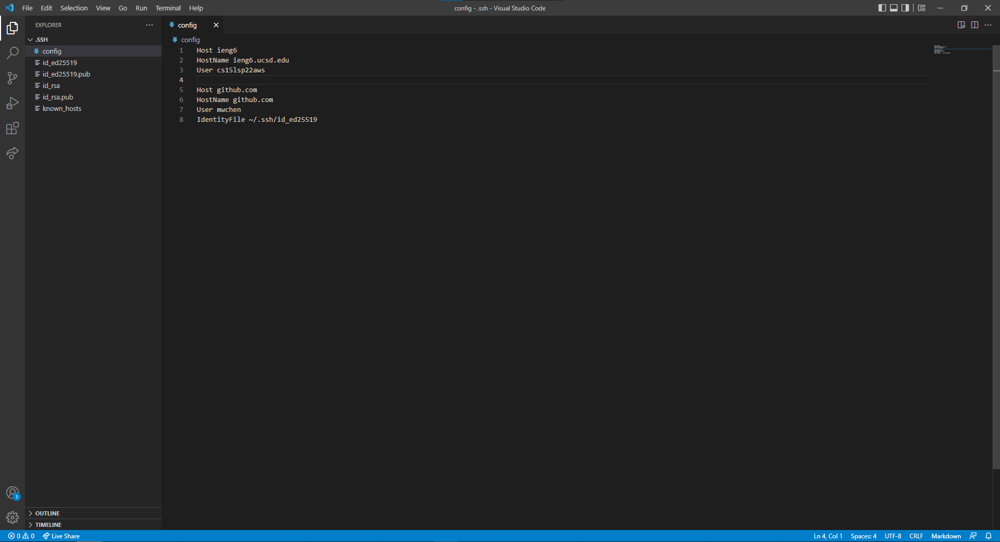
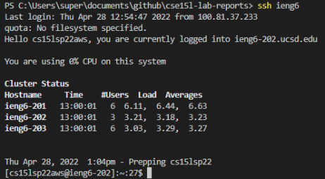
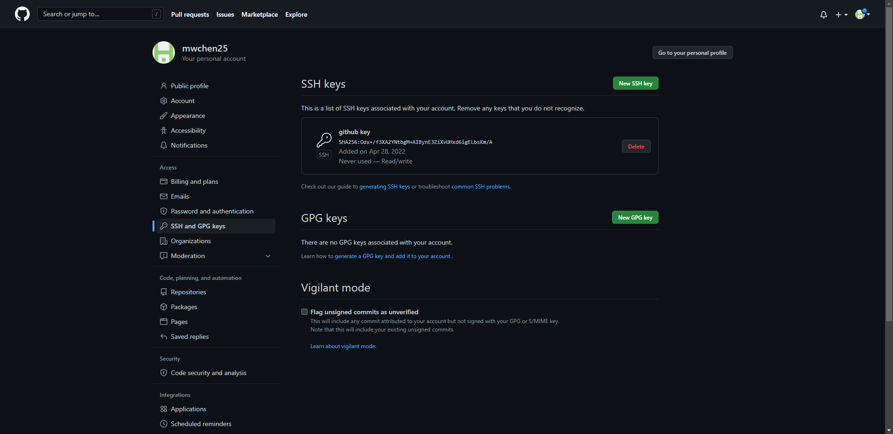
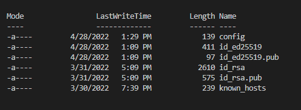
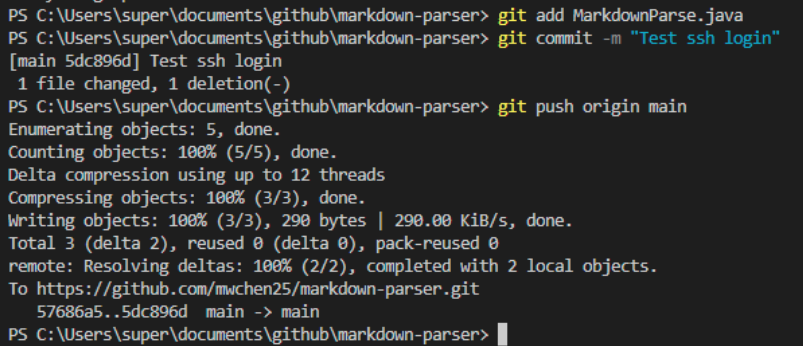
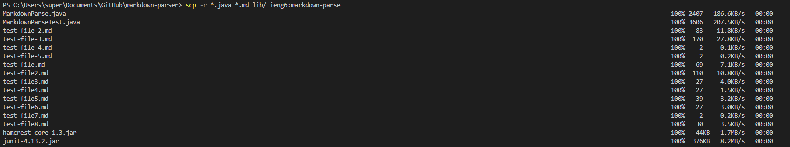
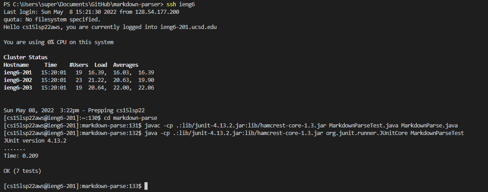
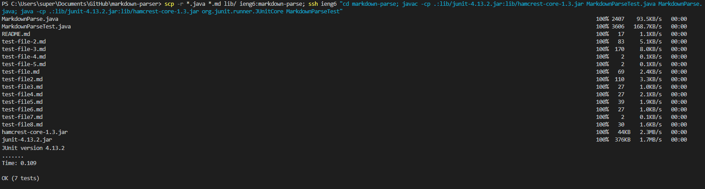

# Lab 5 Group Choice Options

## 1. Streamlining ssh configuration

For this option, I added a config file that allows me to log into my ieng6 account without having to enter my username every time. This makes logging into my remote account much quicker and easier to remember. I did this by creating and modifying the `~/.ssh/config` file in VSCode.

## 2. Setup Github Access from ieng6

For this option, I connected my ieng6 account to my GitHub repository. This allows me to commit and push changes to my GitHub repository directly from my remote machine. I did this by adding a pair of keys to my remote device and my GitHub account.

Both the public and private keys are in this folder on my remote device.

A link to this commit can be found [here.](https://github.com/mwchen25/markdown-parser/commit/9e91d1c93eb3c1b32c241dd2caa71ba14da92418)

## 3. Copy Whole Directories with `scp -r`

For this option, I used the `-r` tag to copy entire directories. This recursively copies all of the files in a directory so that the entire directory is copied, rather than just a single file.

