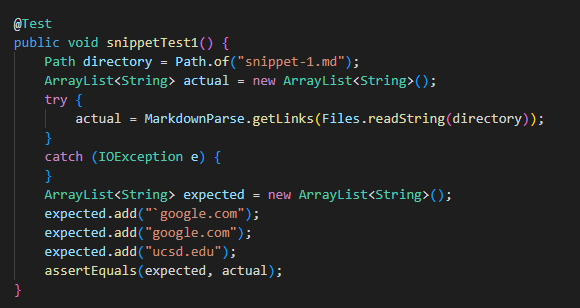
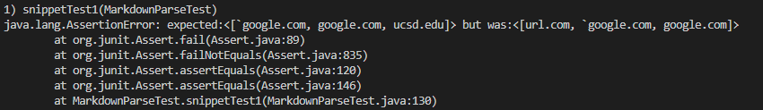
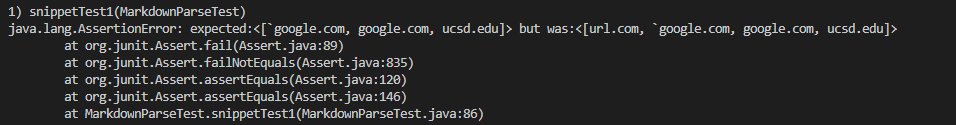
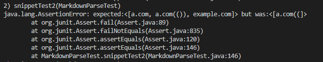
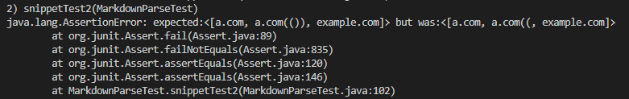
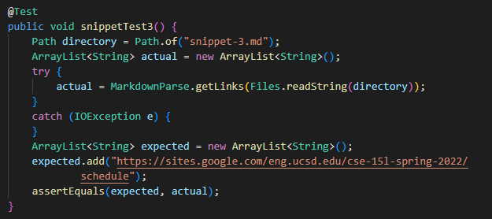
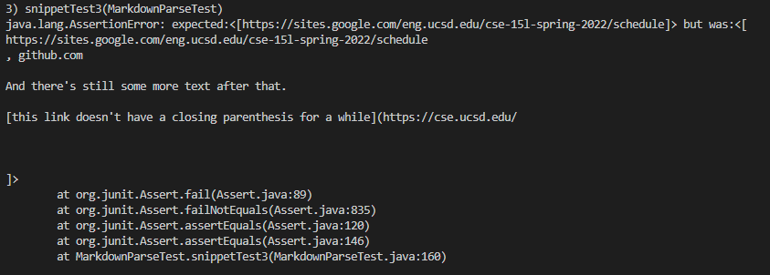
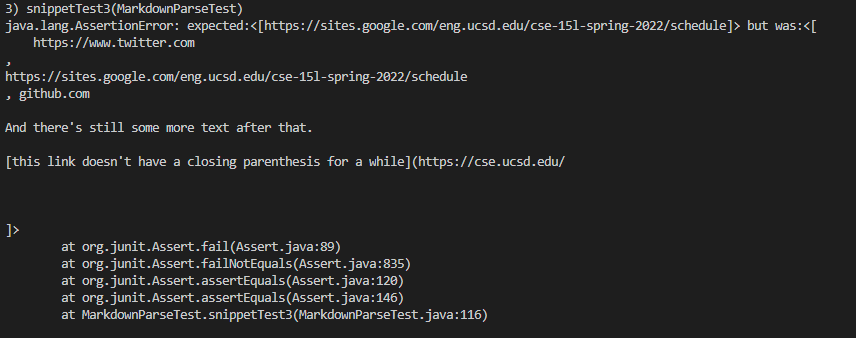

# Markdown Snippets Output Testing and Analysis

A link to my own markdown-parse repository can be found [here](https://github.com/mwchen25/markdown-parser), and a link to the markdown-parse repository my lab group reviewed in lab 7 can be found [here](https://github.com/AllKeng/markdown-parser).

To determine the expected output of each snippet, I used the [CommonMark demo site.](https://spec.commonmark.org/dingus/)

## Snippet 1

The expected output for snippet 1 is the following: ```[`google.com, google.com, ucsd.edu]```.

This image shows the code I used to turn this markdown snippet into a JUnit test.



My implementation of markdown-parse did not pass this test. This is an image of my implementation failing the JUnit test.



The implementation our group reviewed in lab 7 also did not pass this test. This is an image of their implementation failing the JUnit test.



## Snippet 2

The expected output for snippet 2 is the following: ```[a.com, a.com(()), example.com]```.

This image shows the code I used to turn this markdown snippet into a JUnit test.


My implementation of markdown-parse did not pass this test. This is an image of my implementation failing the JUnit test.



The implementation our group reviewed in lab 7 also did not pass this test. This is an image of their implementation failing the JUnit test.



## Snippet 3

The expected output for snippet 3 is the following: ```[https://sites.google.com/eng.ucsd.edu/cse-15l-spring-2022/schedule]```.

This image shows the code I used to turn this markdown snippet into a JUnit test.



My implementation of markdown-parse did not pass this test. This is an image of my implementation failing the JUnit test.



The implementation our group reviewed in lab 7 also did not pass this test. This is an image of their implementation failing the JUnit test.



## Potential code changes

The fix for snippet 1 and all examples with backticks can be accomplished in a few lines of code. If there is an even number of backticks between the square brackets, the link can be parsed normally; if there is an odd number of backticks between the square brackets, the program should check if there is a corresponding backtick either before or after the square brackets. If there is a corresponding backtick then the link is invalid; otherwise, the link is valid and should be added to the final list.

The fix for snippet 2 and all examples with nested parentheses, nested brackets, and escaped brackets is pretty involved. This is because my current check for a complete list revolves around checking if each open bracket and parentheses has a corresponding closed bracket or parentheses, but this check does not account for nested brackets or parentheses. To address this failing test case, I would need to completely rewrite this segment of code and then correctly detect if a pair of brackets or parentheses defines a link in markdown or is a character within the link's title or URL itself.

The fix for snippet 3 and all examples with newlines in brackets and parentheses can be accomplished in a few lines of code. First, I would check if the substring contained within the brackets contains two newline characters right next to each other; if so, the link is invalid. Next, I would check if the substring contained within the parentheses contains any newline characters excluding any a single newline immediately after the opening parentheses or before the closing parentheses; if so, the link is invalid.
