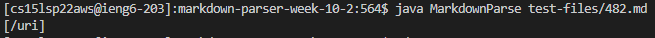
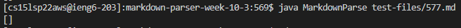

# Differences in Output of Different Implementations of Markdown Parse

I found both tests with different results by running the vimdiff command on the two implementations' respective output.txt files. Links to the two test files can be found here:

[File 482.md](https://github.com/nidhidhamnani/markdown-parser/blob/main/test-files/482.md)

[File 577.md](https://github.com/nidhidhamnani/markdown-parser/blob/main/test-files/577.md)

## File 1. 482.md

This is the output from running this file on my own implementation:


This is the output from running this file on the given implementation:



According to the CommonMark demo site, the correct output is ```[/uri]```. Thus, the given implementation's output is correct, whereas my own implementation is incorrect.

The bug that causes this error in my code is in the code below.


This segment of code is supposed to check whether or not a given link is an image or not; however, if the given link is not an image and is the first link in the file, the underlined code prevents the link from being added to the final list of links, since the indices of the characters ```!``` and ```[``` are 1 apart. Therefore, the link is not added even though it should be recognized as a link by the program.

## File 2. 577.md

This is the output from running this file on my own implementation:



This is the output from running this file on the given implementation:


According to the CommonMark demo site, the correct output is ```[]```. Thus, my own implementation's output is correct, whereas the given implementation's output is incorrect.

The bug that causes this error in my code is in the code below.


The bug in the given implementation that causes this erronerous output is the fact that this implementation does not check if a potential link is an image, i.e. the ```[``` character is preceded by the character ```!```; such a check should be added around where the yellow highlight appears in the image. Since this implementation does not check for this, its output for this file is incorrect while my own implementation is correct.